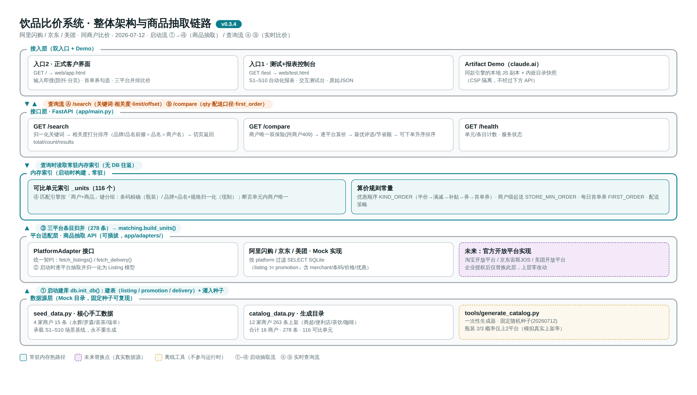
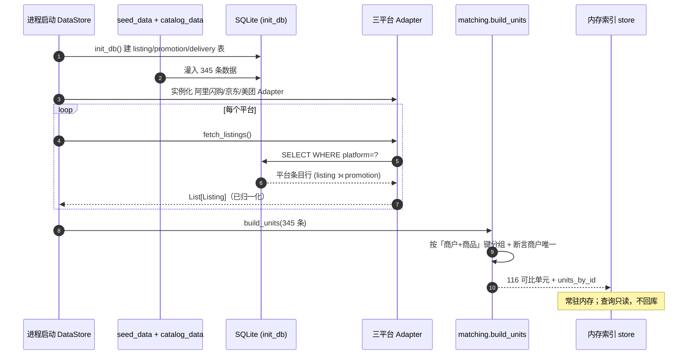
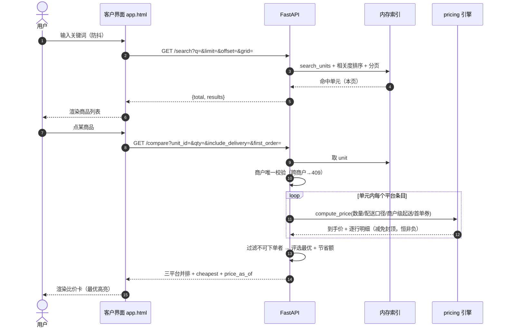
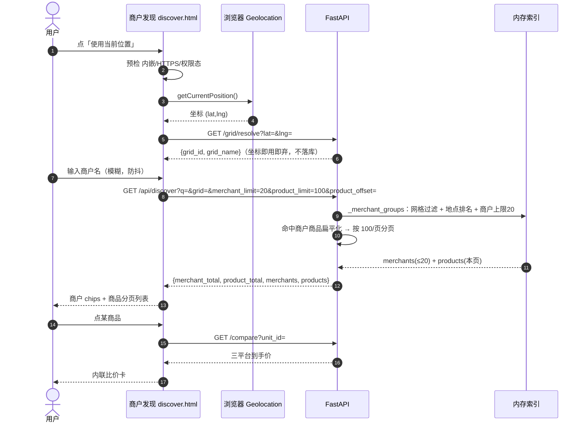

# 商品抽取 API 原理与整体架构

- **文档版本**：v0.3.4（随系统版本演进，见文末版本记录）
- **架构图**：[docs/img/architecture-v0.3.4.png](img/architecture-v0.3.4.png)（版本号入文件名，历史版本随 git 保留）
- **关联文档**：[设计文档.md](设计文档.md) · [测试报告.md](测试报告.md)



---

## 1. 一句话原理

> 商品数据在**启动时**经「数据源 → 建库 → 平台适配器抽取 → 归并 → 匹配成可比单元」五步固化为**常驻内存索引**；查询时（搜索/比价）只读内存索引，不回数据库。抽取的唯一入口是 `PlatformAdapter` 统一契约——这就是将来替换真实平台数据源的插座。

---

## 2. 启动抽取流（①→④，图中自下而上）

### ① 数据源 → 建库（`app/db.py: init_db`）

系统当前有**两份数据源文件**，启动时合并灌入 SQLite：

| 文件 | 内容 | 性质 |
| --- | --- | --- |
| `seed_data.py` | 4 家核心商户 15 条（永辉/罗森/喜茶/瑞幸）| **手工数据**，承载 S1–S10 场景基线，永不重生成 |
| `catalog_data.py` | 12 家商户 330 条上架 | `tools/generate_catalog.py` 固定种子生成（263 条）+ `tools/fill_platform_gaps.py` 补齐平台缺口（+67 条，v0.4.2）——生成目录全部三平台可比 |

`init_db()` 建三张表并灌数：
- `listing`（platform, **merchant**, brand, name, spec, type, barcode, list_price, sale_price）
- `promotion`（listing_id, kind, desc, value, threshold）
- `delivery`（platform, base_fee, free_over）

> 金额一律以「分」存储；`merchant` 是比价边界字段，从源头带到最上层。

### ② 平台适配器抽取（`app/adapters/`）—— 抽取 API 本体

每个平台一个适配器，实现统一契约：

```python
class PlatformAdapter(abc.ABC):
    def fetch_listings(self) -> list[Listing]: ...   # 抽取该平台全部商品条目
    def fetch_delivery(self) -> DeliveryPolicy: ...  # 抽取该平台配送策略
```

当前三个 Mock 实现（阿里闪购/京东/美团）的抽取动作是：**按 `platform` 过滤 SELECT SQLite**，把 `listing ⟕ promotion` 连出的行**归一化为 `Listing` 数据模型**（含商户、条码、价格、优惠列表）。

关键设计：上层只认 `Listing` 模型和这两个方法，**不知道数据从哪来**。将来接入真实数据（淘宝开放平台 / 京东宙斯 JOS / 美团开放平台，均需企业授权），只需新写一个适配器实现把官方接口响应翻译成 `Listing`——匹配、算价、搜索、界面**零改动**。

### ③ 三平台条目归并（`app/main.py` 启动段）

```python
_adapters = [AlibabaAdapter(conn), JDAdapter(conn), MeituanAdapter(conn)]
_all_listings = 三个适配器 fetch_listings() 结果拼接   # 345 条
```

### ④ 匹配成可比单元（`app/matching.py: build_units`）

把 345 条平台条目按「**商户 + 商品**」键分组为 **116 个可比单元**：

- 单元键第一段永远是归一化商户名——**同款商品不同商户绝不合并**（商户约束）；
- 第二段：瓶装用**条码**精确匹配；现制用**品牌+品名+规格**归一化匹配（吸收 `/`、空格、全角空格等写法差异）；
- 构建时断言每个单元内商户唯一（防回归），`/compare` 另有 409 双保险。

产物 `_units`（含 `_units_by_id` 索引）**常驻内存**，同时驻留算价规则常量：优惠顺序 `KIND_ORDER`（半价→满减→补贴→券→首单券）、商户级起送 `STORE_MIN_ORDER`、每日首单券 `FIRST_ORDER_COUPON`、配送策略。

---

## 3. 实时查询流（Ⓐ Ⓑ，图中自上而下）

### Ⓐ `GET /search` —— 从索引召回

归一化关键词 → 对每个单元按**相关度打分**（品牌/品名前缀命中 0 分 > 品名包含 1 分 > 商户名包含 2 分 > 其余字段 3 分，同分按覆盖平台数降序）→ `offset/limit` 切页 → 返回 `total/count/results`。空关键词=浏览全库。

### Ⓑ `GET /compare` —— 对单元逐平台算价

1. 商户唯一性双保险（跨商户 → 409 拒绝比价）；
2. 对单元内每个平台条目调用算价引擎 `compute_price(数量, 配送口径, 商户级起送价, 首单券)`——优惠按固定顺序应用、每项减免封顶于应付（到手价恒非负）、输出逐行明细；
3. 未达起送价的平台标记不可下单并**排除出最优评选**；
4. 可下单平台中评选最优、计算节省额，按到手价升序返回（不可下单排最后）。

**性能特征**：查询全程零数据库往返、零外部调用——这也是数据新鲜度的代价：当前快照在启动时固化，刷新需重启。真实数据阶段将在适配层引入调度刷新（增量+热点），这是架构图上标注的演进点。

---

## 3A. 时序图

以下 Mermaid 时序图在 GitHub 上原生渲染，覆盖三条关键链路。

### 时序图 1 · 启动抽取流（进程启动一次）



### 时序图 2 · 比价查询流（客户界面 `/`）



### 时序图 3 · 商户发现流（`/discover`，含 GPS 定位）



## 4. 版本化约定

- **架构图**：版本号入文件名（`docs/img/architecture-v<版本>.png`），改版时新增文件而非覆盖，历史版本随 git 保留可追溯；
- **本文档**：随系统版本演进，配合 [设计文档.md](设计文档.md) §12 版本记录；
- **数据目录**：`catalog_data.py` 固定种子生成，重生成即形成新版本（测试哨兵 `test_catalog_coverage_sentinel` 钉死当前构成 116 单元/两平台 3/缺美团 1/起送拦截 1，改动即报警）。

## 5. 版本记录

| 版本 | 架构图 | 变更 |
| --- | --- | --- |
| v0.3.4 | `img/architecture-v0.3.4.png` | 首版整体架构图：双入口 + 内存索引 + 可插拔适配层 + 固定种子数据源；商品抽取链路 ①→④ 与查询流 Ⓐ Ⓑ 标注 |
| v0.6.0 | （复用上图）| §3A 新增三张 Mermaid 时序图：启动抽取流 / 比价查询流 / 商户发现流（含 GPS 定位）|
