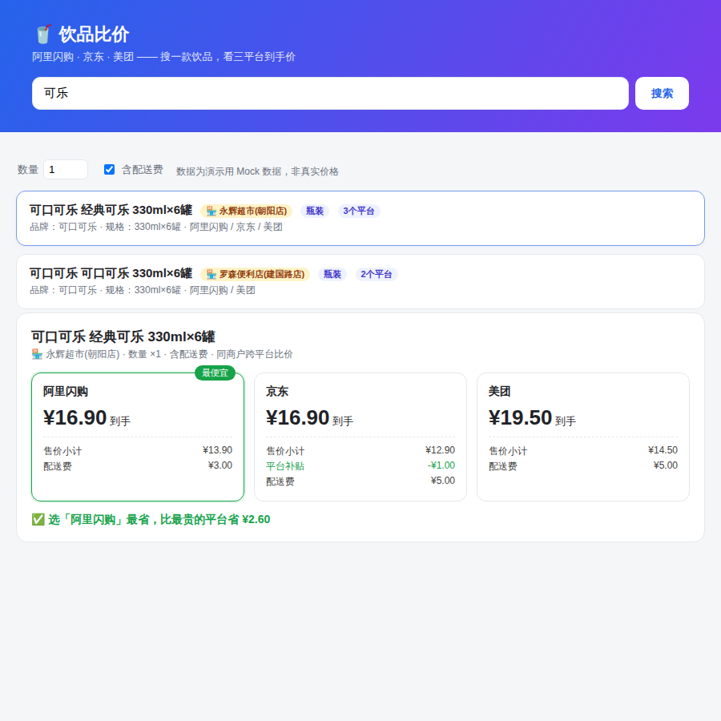
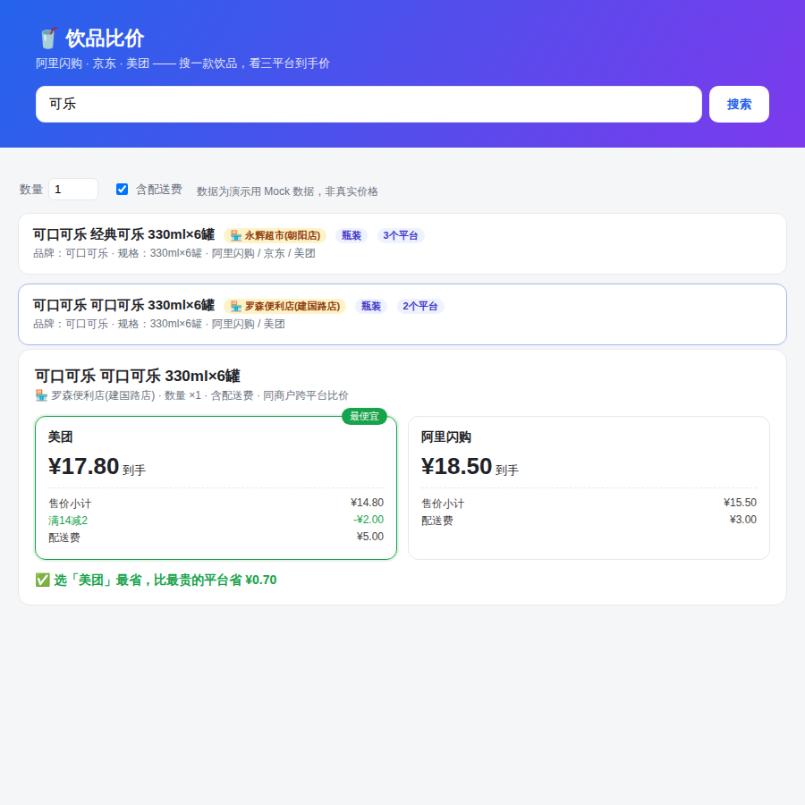
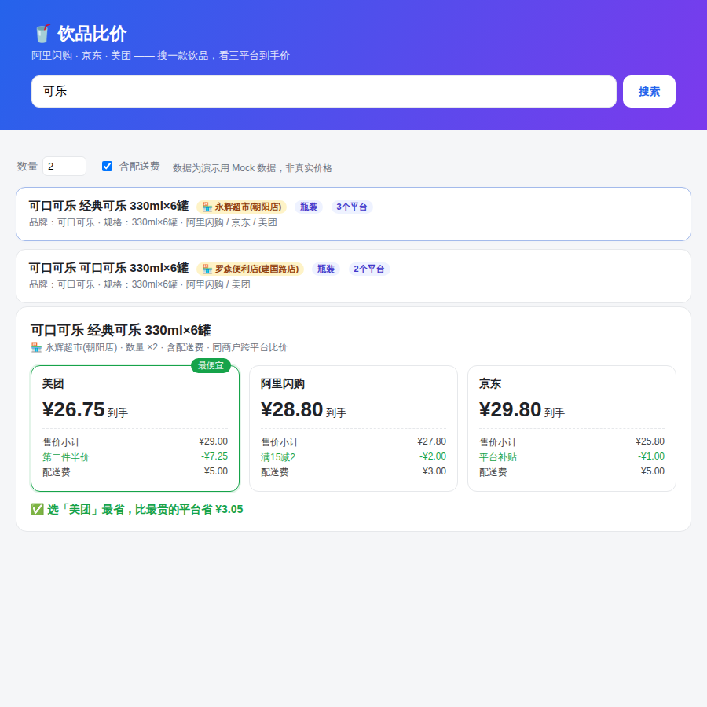
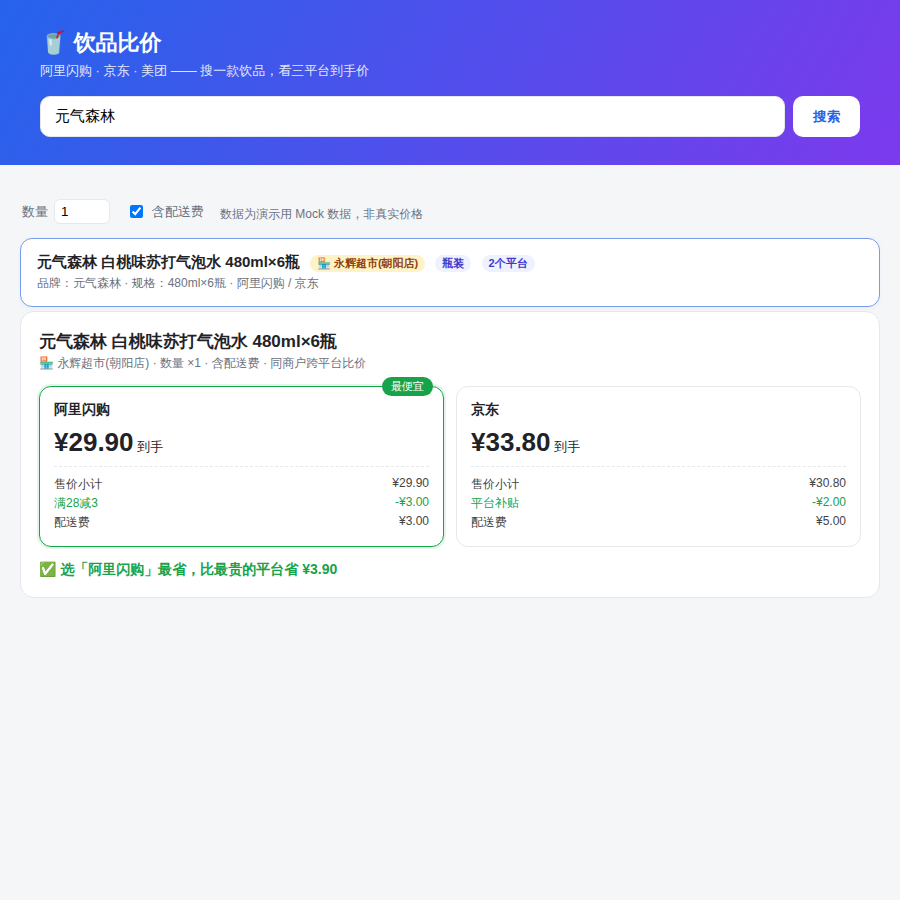
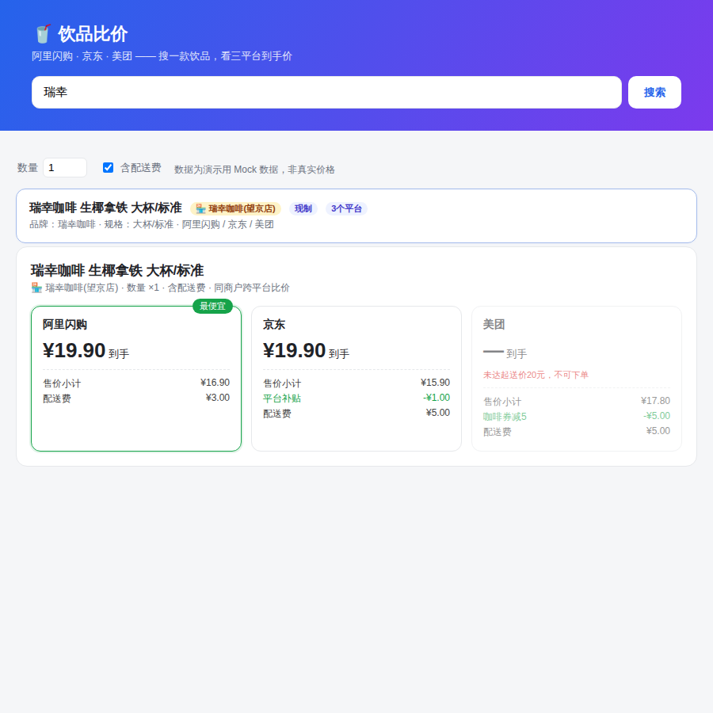
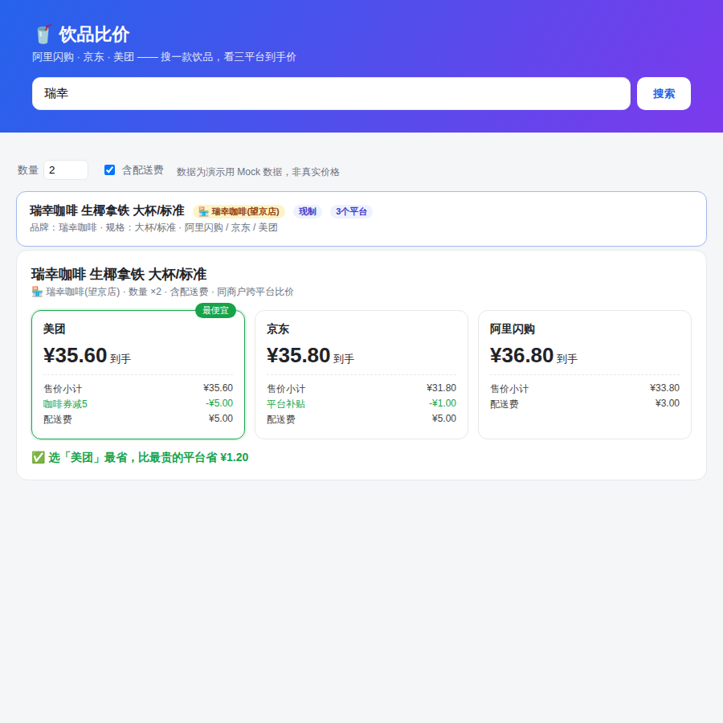

# 饮品比价系统 · 测试报告

- **日期**：2026-07-11
- **版本**：v0.2（商户约束重构后）
- **测试环境**：云端沙盒（Linux / Python 3.11 / FastAPI + Uvicorn / Chromium 无头浏览器）
- **测试方法**：
  1. **单元/接口测试**：`pytest`，覆盖匹配引擎、到手价引擎、HTTP 接口；
  2. **端到端 UI 测试**：7 个场景，每个场景走**完全相同的界面流程**（打开页面 → 设置数量/配送开关 → 搜索 → 点击目标商户卡片 → 查看比价结果），由 Playwright 驱动真实 Chromium 渲染并截图，同时捕获 `/compare` 接口的实际返回作为结果依据。

---

## 1. 结果总览

| 类别 | 数量 | 结果 |
| --- | --- | --- |
| pytest 单元/接口测试 | 24 | ✅ 全部通过 |
| 端到端 UI 场景 | 7 | ✅ 全部符合预期 |

**核心验证点：比价的每一个产品都在相同商户下** ——
- 匹配键强制包含商户（`app/matching.py: unit_key`），同款商品不同商户 → 独立可比单元；
- 单元构建时断言组内商户唯一（`app/matching.py: build_units`）；
- `/compare` 接口双保险校验，跨商户单元返回 409 拒绝比价（`app/main.py`）；
- 全量种子数据自检测试 `test_every_unit_is_single_merchant` 通过。

---

## 2. 端到端场景明细

### S1 · 永辉超市·可乐 ×1（含配送）—— 同商户三平台可比

| 平台 | 到手价 | 说明 |
| --- | --- | --- |
| 阿里闪购 | **¥16.90** ✅最优 | 13.90 + 配送3.00 |
| 京东 | ¥16.90 | 12.90 − 补贴1.00 + 配送5.00 |
| 美团 | ¥19.50 | 14.50 + 配送5.00 |

**预期**：三平台均可比（同为永辉超市），标出最优。**实际**：一致，省 ¥2.60。✅

---

### S2 · 罗森便利店·同款可乐 —— 商户隔离核心场景

同一条码的可乐，罗森与永辉**拆为两个独立可比单元**（搜索结果两张卡片），罗森单元只在其上架的 2 个平台内比价，绝不与永辉的价格混比。

| 平台 | 到手价 |
| --- | --- |
| 美团 | **¥17.80** ✅最优（14.80 − 券2.00 + 配送5.00）|
| 阿里闪购 | ¥18.50 |

**预期**：与永辉可乐互相隔离、仅 2 平台可比。**实际**：一致，省 ¥0.70。✅

---

### S3 · 永辉·可乐 ×2 —— 数量触发优惠、最优平台翻转

| 平台 | 到手价 | 说明 |
| --- | --- | --- |
| 美团 | **¥26.75** ✅最优 | 29.00 − 第二件半价7.25 + 配送5.00 |
| 阿里闪购 | ¥28.80 | 27.80 − 满15减2 + 配送3.00 |
| 京东 | ¥29.80 | 25.80 − 补贴1.00 + 配送5.00 |

**预期**：×1 时美团最贵（S1），×2 时第二件半价生效应反超为最优。**实际**：翻转成立，省 ¥3.05。✅

---

### S4 · 元气森林 —— 单平台缺货的降级展示

美团未上架该商品 → 单元仅含阿里闪购/京东两条目，正常两平台比价，不因缺一个平台而报错。

| 平台 | 到手价 |
| --- | --- |
| 阿里闪购 | **¥29.90** ✅最优（29.90 − 满28减3 + 配送3.00）|
| 京东 | ¥33.80 |

**预期**：两平台可比、优雅降级。**实际**：一致，省 ¥3.90。✅

---

### S5 · 瑞幸·生椰拿铁 ×1 —— 起送价拦截

美团起送价 ¥20，单杯小计 ¥17.80 未达 → 美团列**灰显并提示「未达起送价20元，不可下单」**，且不参与最优评选。

| 平台 | 到手价 | 状态 |
| --- | --- | --- |
| 阿里闪购 | **¥19.90** ✅最优 | 可下单 |
| 京东 | ¥19.90 | 可下单 |
| 美团 | — | ❌ 未达起送价 |

**预期**：未达起送的平台被拦截且不评优。**实际**：一致。✅

---

### S6 · 瑞幸·生椰拿铁 ×2 —— 达到起送后恢复三方可比

两杯小计 ¥35.60 越过美团起送线，且满 ¥15 咖啡券生效。

| 平台 | 到手价 |
| --- | --- |
| 美团 | **¥35.60** ✅最优（35.60 − 券5.00 + 配送5.00）|
| 京东 | ¥35.80 |
| 阿里闪购 | ¥36.80 |

**预期**：美团恢复可下单并因券成为最优。**实际**：一致，省 ¥1.20。✅

---

### S7 · 永辉·可乐 ×1（不含配送费）—— 口径切换影响结论

关闭「含配送费」开关后，同一商品最优平台由阿里闪购（S1）变为京东——验证配送费口径对结论的实质影响与开关的正确性。

| 平台 | 到手价（不含配送）|
| --- | --- |
| 京东 | **¥11.90** ✅最优（12.90 − 补贴1.00）|
| 阿里闪购 | ¥13.90 |
| 美团 | ¥14.50 |

**预期**：口径切换后最优翻转为京东。**实际**：一致，省 ¥2.60。✅

---

## 3. pytest 明细（24 项）

**匹配引擎 / 商户约束（`tests/test_matching.py`，10 项）**

| 测试 | 验证点 | 结果 |
| --- | --- | --- |
| test_same_merchant_same_product_merged_across_platforms | 同商户同条码跨三平台合并 | ✅ |
| test_same_product_different_merchant_not_merged | 同条码不同商户必须拆分 | ✅ |
| test_every_unit_is_single_merchant | 全量数据单元商户唯一自检 | ✅ |
| test_made_drink_same_merchant_matched_despite_spec_format | 现制规格写法差异归一化 | ✅ |
| test_made_drink_different_merchant_not_merged | 同品牌不同门店拆分 | ✅ |
| test_different_products_not_merged | 不同商品不合并 | ✅ |
| test_search_filters_by_keyword_and_merchant | 关键词/商户名搜索 | ✅ |
| test_api_search_returns_merchant | 搜索接口返回商户、可乐拆2单元 | ✅ |
| test_api_compare_single_merchant_only | 比价结果全部同商户 | ✅ |
| test_api_endpoints | 健康检查/搜索/比价链路 | ✅ |

**到手价引擎（`tests/test_pricing.py`，14 项）**

| 测试 | 验证点 | 结果 |
| --- | --- | --- |
| test_basic_no_promo_with_delivery | 基础价+配送费 | ✅ |
| test_free_delivery_over_threshold | 满额免配送 | ✅ |
| test_exclude_delivery | 不含配送口径 | ✅ |
| test_full_reduction_applies_above_threshold | 满减达门槛生效 | ✅ |
| test_full_reduction_skipped_below_threshold | 满减未达门槛跳过 | ✅ |
| test_second_half_price | 第二件半价（2件）| ✅ |
| test_second_half_price_odd_quantity | 第二件半价（3件只折一对）| ✅ |
| test_subsidy_capped_at_payable | 补贴封顶不超应付 | ✅ |
| test_min_order_not_reached | 起送价拦截 | ✅ |
| test_min_order_reached_by_quantity | 多件达到起送 | ✅ |
| test_stacked_promotions_order | 满减+券按序叠加 | ✅ |
| test_quantity_unlocks_full_reduction | 多件解锁满减 | ✅ |
| test_coupon_below_threshold_not_applied | 券未达门槛不生效 | ✅ |
| test_quantity_unlocks_free_delivery | 多件解锁免配送 | ✅ |

---

## 4. 结论与遗留

- **结论**：商户约束重构后，比价的每一个产品都严格限定在相同商户下；7 个端到端场景与 24 项自动化测试全部通过，核心链路（搜索→匹配→算价→比价→展示）行为正确。
- **遗留/说明**：
  - 数据为 Mock 演示数据，非真实价格；接真实数据源后需重跑本报告全部场景；
  - 商户跨平台身份对齐目前按「归一化商户名」，真实数据阶段需引入商户主数据映射（同一门店在各平台名称可能不同）。
