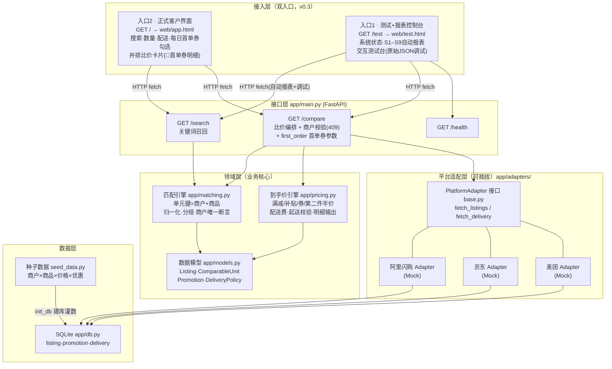

# 饮品比价系统 · 设计文档

- **版本**：v0.3（每日首单券 + 双入口界面）
- **范围**：对 **阿里闪购 / 京东 / 美团** 三个平台上的**饮料饮品**进行比价
- **目标**：用户搜索一款饮品，系统展示三个平台的**到手价**并排对比，标出最便宜方
- **关联文档**：[测试报告.md](测试报告.md) · [商品抽取API原理.md](商品抽取API原理.md)（含整体架构图 v0.3.4，版本化：`img/architecture-v<版本>.png`）

---

## 1. 目标与范围

### 1.1 要做的

- 比价平台：**阿里闪购、京东、美团**（三方）
- 品类：**饮料 / 饮品**
  - 瓶装/罐装标品（可乐、矿泉水、瓶装茶饮/果汁…）
  - 现制饮品（奶茶、咖啡、鲜榨…）
- 核心能力：饮品搜索 → 跨平台同款匹配 → 到手价计算 → 三方并排比价 → 标注最优

### 1.2 本期不做

- 不做代下单/代付（仅展示与跳转）
- 不做饮品以外品类
- 不做真实平台实时抓取（先用 Mock 数据，适配器可插拔，见 §5）

---

## 2. 核心规则：同商户比价约束 ⭐

**比价的每一个产品必须来自相同的商户（门店）。** 这是 v0.2 引入的硬性业务规则：

> 只有**同一家商户**在不同平台上架的同款商品，才会被对齐为一个「可比单元」参与比价。同款商品（哪怕条码完全相同）由不同商户售卖时，形成**多个互相独立**的可比单元，互不比价。

**为什么**：不同商户的进货成本、配送起点、服务质量不同，跨商户混比会造成「看起来便宜但根本不是同一家店」的误导；同商户跨平台比价才回答用户真正的问题——*同一家店的同一件商品，走哪个平台下单更便宜*。

**三层保障**：

| 层 | 机制 | 位置 |
| --- | --- | --- |
| 匹配层 | 可比单元键 = **商户 + 商品**（条码或品牌+品名+规格）| `app/matching.py: unit_key` |
| 构建层 | 单元构建时断言组内商户唯一，防未来回归 | `app/matching.py: build_units` |
| 接口层 | `/compare` 双保险校验，跨商户单元返回 409 拒绝比价 | `app/main.py` |

**商户身份对齐说明**：当前按「归一化商户名」对齐跨平台的同一门店；真实数据阶段需引入商户主数据映射（同一门店在各平台的挂名可能不同，如「永辉超市(朝阳店)」vs「永辉超市朝阳北路店」）。

---

## 2A. 每日首单券（v0.3 新增）⭐

**规则**：每个平台都有一张「每日首单券」——用户当天在该平台的**第一单**可用。这是与用户当日状态相关的平台级券，直接影响「今天走哪个平台下单更便宜」的结论，必须反映在比价界面。

| 平台 | 券面额（Mock 演示值）| 使用门槛 |
| --- | --- | --- |
| 阿里闪购 | 减 ¥4 | 满 ¥10 |
| 京东 | 减 ¥3 | 无门槛 |
| 美团 | 减 ¥5 | 满 ¥15 |

**建模与交互**：

- 用户侧：比价界面提供三个平台的「今日首单」勾选（默认全勾——最常见的比价场景是当天还没下过单）；勾选的平台在算价时附加首单券。
- 引擎侧：首单券作为 `kind="首单券"` 的 `Promotion` 由调用方传入 `compute_price(first_order_coupon=...)`，参与顺序排在店铺优惠之后（第二件半价 → 满减 → 补贴 → 券 → **首单券**），同样受门槛与负价封顶约束。**门槛按前序优惠扣减后的应付金额判断**。
- API 侧：`/compare?first_order=阿里闪购,京东` 传入当日尚未下单的平台清单；**默认为空（不启用）**，保证既有场景基线（S1–S7）不漂移。
- 展示侧：明细中首单券行带 🎫 标识；比价小结标注「首单券生效平台」。

**典型效果**（种子数据实测）：永辉可乐 ×1 首单全开时，美团券因门槛 ¥15 未达（小计 ¥14.50）不生效、阿里以 ¥12.90 最优；买 ×2 后美团券达门槛生效，以 ¥21.75 反超成为最优——首单券会真实改变比价结论。

---

## 3. 为什么饮品比餐饮外卖更好比

饮品品类**标准化程度高**，商户内的商品对齐天然更可靠：

| 类型 | 匹配主键（商户内）| 匹配强度 |
| --- | --- | --- |
| 瓶装/罐装标品 | 条码 | 强（精确匹配）|
| 现制饮品 | 品牌 + 品名 + 规格（杯型/糖冰）| 中（归一化匹配）|

现制饮品的规格写法差异（`大杯/正常糖/去冰` vs `大杯 正常糖 去冰` vs 全角空格）由归一化器统一吸收。

---

## 4. 系统架构

### 4.1 组件架构图



### 4.2 组件职责与相互关系

| 组件 | 职责 | 依赖谁 | 被谁依赖 |
| --- | --- | --- | --- |
| **客户界面**（`web/app.html`，入口2 `/`）| 面向正式用户：搜索、数量/配送开关、**每日首单券勾选**、单元卡片（含商户标签）、三平台并排比价卡与明细（🎫首单券行）、最优高亮。无任何测试元素 | 接口层（HTTP）| 最终用户 |
| **测试+报表控制台**（`web/test.html`，入口1 `/test`）| 面向开发/运营：系统状态卡片；**S1–S9 自动化场景报表**（加载即对真实 API 逐一执行并出 PASS/FAIL）；交互测试台（场景一键载入、首单券/商户筛选、原始 JSON 输出）| 接口层（HTTP）| 开发/测试/运营 |
| **接口层**（`app/main.py`）| 启动时编排「建库→适配器取数→构建可比单元」；`/search` 召回；`/compare` 比价编排（数量、配送口径、起送校验、**first_order 首单券**、最优评选、跨商户 409）；`/`与`/test` 双入口路由 | 匹配引擎、到手价引擎、适配器 | 两个前端 |
| **匹配引擎**（`app/matching.py`）| 归一化（大小写/空格/分隔符）；单元键=**商户+条码/品名规格**；分组构建可比单元并断言商户唯一；关键词搜索（含商户名）| 数据模型 | 接口层 |
| **到手价引擎**（`app/pricing.py`）| 按序应用第二件半价→满减→补贴→券；配送费与免配门槛；起送价校验；输出逐行明细 | 数据模型 | 接口层 |
| **数据模型**（`app/models.py`）| `Listing`（含 merchant）、`ComparableUnit`（含 merchant 约束）、`Promotion`、`DeliveryPolicy` | — | 匹配/算价/适配器 |
| **适配器接口**（`app/adapters/base.py`）| 统一取数契约 `fetch_listings()` / `fetch_delivery()`；Mock 基类读 SQLite | 数据层 | 三平台适配器、接口层 |
| **三平台适配器**（`alibaba/jd/meituan.py`）| 各平台一个实现，当前为 Mock；未来替换为官方 API/合规采集，上层不动 | 适配器接口 | 接口层 |
| **数据层**（`app/db.py` + `seed_data.py`）| 建表灌数（listing 含 merchant 列）、按平台读取条目与配送策略 | 种子数据 | 适配器 |
| **测试**（`tests/`）| 24 项：匹配/商户约束 10 项 + 算价 14 项 | 全部组件 | CI/开发者 |

### 4.3 关键数据流

**启动流**：
```
seed_data → db.init_db 建库灌数
→ 三平台 Adapter.fetch_listings()（各自平台条目）
→ matching.build_units()（按 商户+商品 分组 → 可比单元，断言商户唯一）
→ 常驻内存供查询
```

**比价查询流**：
```
用户(关键词, 数量, 是否含配送)
→ /search 召回可比单元（卡片带商户标签）
→ 用户点击某单元 → /compare
   → 商户唯一性双保险校验（违反 → 409）
   → 对单元内每个平台条目：pricing.compute_price(数量, 配送口径, 起送价)
   → 过滤不可下单者后评选最优、计算节省
→ 前端并排渲染（最优高亮、明细逐行、不可下单灰显）
```

---

## 5. 数据来源策略（关键决策）

三大平台**没有公开的「正式比价 API」可以直接接入**——商品/价格数据接口均需企业资质入驻各自官方开放平台并获得授权。为保证**沙盒内即可跑、可测**：

- **当前（v0.3.1）**：搜索/比价链路已按生产级实现（全库检索、相关度排序、分页），数据为「适配器 + 全商户 Mock 目录」——16 家商户、345 条上架、116 个可比单元（固定种子生成 + 平台缺口补齐，除 3 个有意保留的场景位外全部三平台可比），全链路真实可运行。
- **适配器可插拔**：`PlatformAdapter` 接口稳定，未来接真实数据源只替换实现类，搜索/匹配/算价/界面零改动。
- **正式接入路径（需企业主体申请）**：
  - 阿里：淘宝/天猫开放平台（open.taobao.com），申请商品类目 API 授权；
  - 京东：京东宙斯开放平台 JOS（jos.jd.com）；
  - 美团：美团开放平台（open.meituan.com / 到家/外卖开放能力）。
  三者均需开发者企业认证 + 类目权限审批；无授权的抓取方案须先过法务合规评审。

---

## 6. 数据模型

```
Listing         平台商品条目   platform, merchant⭐, brand, name, spec,
                              type(bottled/made), barcode?, list_price, sale_price, promotions[]
ComparableUnit  可比单元       id, merchant⭐(单元内唯一), name, brand, spec, type, listings[]
Promotion       优惠          kind(满减/补贴/券/第二件半价), desc, value, threshold
DeliveryPolicy  配送策略       platform, base_fee, free_over
STORE_MIN_ORDER 起送价        (商户, 平台) → 起送金额；商家自设的门店属性，未配置=0
```

- ⭐ `merchant` 是 v0.2 新增的比价边界字段，贯穿条目→单元→比价结果全链路。
- 金额统一以「分」存储，展示换算为「元」。

---

## 7. 到手价计算口径

```
单平台到手价 =
    售价(sale_price) × 数量
  − 第二件半价（每两件折一件半价）
  − 满减（小计达门槛）
  − 平台补贴（封顶不超应付）
  − 优惠券（达门槛，按序叠加）
  − 每日首单券（用户勾选该平台今日首单时参与，门槛按扣减后应付判断）
  + 配送费（小计满免配线则为 0）
  （起送价：商户×平台级门店属性，小计未达 → 标记不可下单、不参与最优评选）
  （每项减免封顶于当前应付，到手价恒非负）
```

- 优惠按固定顺序应用：第二件半价 → 满减 → 补贴 → 券（规则表驱动，见 `pricing._KIND_ORDER`）。
- 输出**结构化明细**（售价→各项优惠→配送→到手价），前端逐行透明展示。

---

## 8. 接口设计

| 接口 | 方法 | 入参 | 出参 |
| --- | --- | --- | --- |
| `/search` | GET | `q`（关键词：商品名/品牌/商户名，空=浏览全库）, `limit`(1-100, 默认20), `offset` | `total` 命中总数 + 本页可比单元列表（相关度排序：品牌/品名前缀 > 品名包含 > 商户名包含）|
| `/compare` | GET | `unit_id`, `qty?`, `include_delivery?`, `first_order?`（当日未下单平台，逗号分隔，默认空=不启用）| 各平台到手价+明细+merchant、first_order 生效清单、最优、节省；跨商户 → 409 |
| `/merchants` | GET | `q`（商户名关键词，空=全部商户）| **聚合 API**：按商户分组返回每家商户的全部商品名列表（含 unit_id 可直接比价）|
| `/health` | GET | - | 服务状态、单元/条目数 |
| `/` | GET | - | 入口2 · 正式客户界面（app.html）|
| `/test` | GET | - | 入口1 · 测试+报表控制台（test.html）|

`/compare` 返回示例（结构示意）：

```json
{
  "beverage": {"name": "可口可乐 经典可乐 330ml×6罐", "merchant": "永辉超市(朝阳店)"},
  "quantity": 1,
  "include_delivery": true,
  "platforms": [
    {"platform": "阿里闪购", "merchant": "永辉超市(朝阳店)", "final_price": 1690,
     "orderable": true, "breakdown": [{"label": "售价小计", "amount": 1390}, ...]},
    {"platform": "京东", "merchant": "永辉超市(朝阳店)", "final_price": 1690, ...},
    {"platform": "美团", "merchant": "永辉超市(朝阳店)", "final_price": 1950, ...}
  ],
  "cheapest": "阿里闪购",
  "savings_vs_max": 260
}
```

---

## 9. 技术选型

| 层 | 选型 | 理由 |
| --- | --- | --- |
| 后端 | Python + FastAPI | 轻量、自带 OpenAPI 文档、沙盒秒起 |
| 存储 | SQLite（种子数据）| 零配置，克隆即跑 |
| 前端 | 原生 HTML + JS（单页）| 比价并排展示，Chromium 可直接演示 |
| 适配器 | 统一接口 + Mock 实现 | 可插拔，未来接真实数据 |
| 测试 | pytest + Playwright(Chromium) | 单元/接口 + 端到端 UI 截图验证 |

---

## 10. 目录结构

```
beverage-price-comparison/
├── docs/
│   ├── 设计文档.md          本文档
│   ├── 测试报告.md          7 场景端到端 + 24 项 pytest 汇总
│   └── img/                 各场景 UI 截图
├── app/
│   ├── main.py              FastAPI 入口 + 比价编排 + 商户校验
│   ├── models.py            数据模型（Listing 含 merchant）
│   ├── db.py                SQLite + 种子数据
│   ├── matching.py          匹配引擎（商户+商品 单元键）
│   ├── pricing.py           到手价引擎
│   └── adapters/            平台适配器（阿里闪购/京东/美团，Mock 可插拔）
├── web/
│   ├── app.html             入口2 · 正式客户界面（含首单券勾选）
│   └── test.html            入口1 · 测试+报表控制台（S1–S9 自动报表）
├── tests/                   pytest（匹配/商户约束 + 算价 + 边界 + 首单券 + 接口）
├── seed_data.py             Mock 种子数据（商户×商品×优惠）
└── requirements.txt
```

---

## 11. 沙盒测试说明

- 本系统设计为在云端沙盒容器内**直接运行与演示**：启动 FastAPI 服务 + 前端页面，用内置种子数据完整验证搜索/匹配/算价/比价全流程。
- 端到端验证结论见 [测试报告.md](测试报告.md)：7 个 UI 场景（同一界面流程逐一截图）+ 24 项自动化测试全部通过。
- 沙盒容器为临时环境，适合开发与演示；长期在线部署需另配服务器/云平台。

---

## 12. 版本记录

| 版本 | 内容 |
| --- | --- |
| v0.1 | 三平台饮品比价 MVP：匹配（条码/品名规格）、到手价引擎、并排比价前端 |
| v0.2 | **商户约束重构**：比价严格限定同商户；商户贯穿模型/匹配/接口/前端；测试 14→24 项；新增端到端测试报告与组件架构图 |
| v0.2.1 | 边界测试 16 项；修复 BUG-001（满减/券未封顶导致到手价可为负）|
| v0.2.2 | 手机自适应与主流浏览器兼容适配 |
| v0.3 | **每日首单券**进入比价口径与界面（默认全勾、门槛按扣减后应付判断）；**界面拆分双入口**：`/` 正式客户界面（app.html）与 `/test` 测试+报表控制台（test.html，S1–S9 自动化报表）；测试 40→50 项 |
| v0.3.1 | **正式搜索 API**：全商户产品库检索（16 商户/278 上架/116 可比单元）、相关度排序、limit/offset 分页；客户界面输入即搜（防抖）+ 加载更多 + 选择→比价；测试 50→53 项 |
| v0.3.2 | **BUG-002 修复**：起送价由平台级迁移为**商户×平台级**门店属性（`STORE_MIN_ORDER`，未配置=0，对所有品类生效）；瑞幸美团不足 ¥20 恢复可下单并成为最优（S5 改写为修复验证场景）；喜茶(国贸店)美团配置 ¥26 承担起送拦截演示（新增 S10）；新增专项测试 `tests/test_min_order.py` 7 项，测试 53→60 项 |
| v0.3.3 | **BUG-003 修复**：「加载更多」追加请求误用输入框实时值（防抖窗口竞态 → 已显示>共计的计数错乱），改为钉死列表所属查询词；新增 E2E 回归 `tests/e2e/load_more.spec.mjs`（12 断言）与后端分页契约测试 2 项，测试 60→62 项 |
| v0.3.4 | **平台覆盖专项测试**：为全部 70 个两平台单元、23 个缺美团单元、美团起送拦截单元逐一生成参数化用例 + 目录构成哨兵 + 116 单元全库扫描（`tests/test_coverage.py` 96 项，一次全过）；测试 62→158 项 |
| v0.4.0 | **商户直达（聚合查询）功能板块**：新增聚合 API `GET /merchants?q=`（按商户名聚合全部商品名列表）；客户界面新增第二个搜索框，实时（防抖+过期响应丢弃）调用聚合 API，按商户分组渲染商品名列表，点击任一商品直接进入比价；Demo 同构实现；测试 158→165 项 |
| v0.4.1 | **生产化基础（上线计划阶段一）**：DataStore 可重建快照（`POST /admin/refresh` 令牌保护 + `REFRESH_INTERVAL_S` 定时刷新，失败保留旧快照）；`/compare` 返回 `price_as_of` 新鲜度；请求日志与 `GET /metrics`（P50/P95/P99）；滑动窗口限流（health 豁免）+ CORS + 环境变量配置；Dockerfile/docker-compose/CI（GitHub Actions: pytest+E2E）；测试 165→173 项。详见 [上线计划.md](上线计划.md) |
| v0.4.2 | **平台缺口补齐**：`tools/fill_platform_gaps.py` 为生成目录 67 个两平台单元确定性补上缺失平台（条目 278→345，单元 ID 零扰动），平台分布 {2平台:70, 3平台:46} → **{2平台:3, 3平台:113}**。**有意保留的 3 个两平台单元及原因**：① 永辉·元气森林（缺美团）——S4「单平台缺货优雅降级」场景演示位；② 罗森·可乐（缺京东）——S2 商户隔离场景 + 模拟便利店在京东到家覆盖低的现实；③ 喜茶·多肉葡萄（缺京东）——模拟京东现制茶饮覆盖少的现实 + S10 起送场景。覆盖专项参数化用例随构成收敛（173→84 项，测试数量忠实反映数据分布），哨兵更新为 116/3/1/1 |
| v0.5.0 | **定位与商圈网格（真实上线 PRD §4 骨架）**：`geo_data.py` 4 个北京商圈网格 + 16 商户坐标/评分/月售（Mock）；`GET /grids` 与 `GET /grid/resolve`（坐标→网格，坐标不落库，超 3km 提示不在服务区）；`/search` 与 `/merchants` 新增 `grid` 参数（网格过滤零泄漏，默认不传=全库，向后兼容）；`/merchants` 带 grid 时按 **PRD 排名分**（0.35覆盖度+0.25销量+0.20距离衰减+0.20评分）降序并透出可解释因子；客户界面**位置胶囊**（GPS 授权→解析 / 拒绝→手动商圈 / 服务区外提示，三级降级，商圈存 localStorage）；新增 `tests/test_geo.py` 13 项（含排名分与公示因子一致性校验），测试 84→97 项；E2E 实测 GPS 授权/拒绝/区外三场景 |

## 13. 已知遗留（待决策）

- ~~起送价建模粒度~~ ✅ 已于 v0.3.2 修复：`STORE_MIN_ORDER` 以 (商户, 平台) 为键。真实数据阶段起送价随门店数据由适配器带入。
- 商户跨平台身份映射（全角/半角、异名门店）待商户主数据阶段处理。
