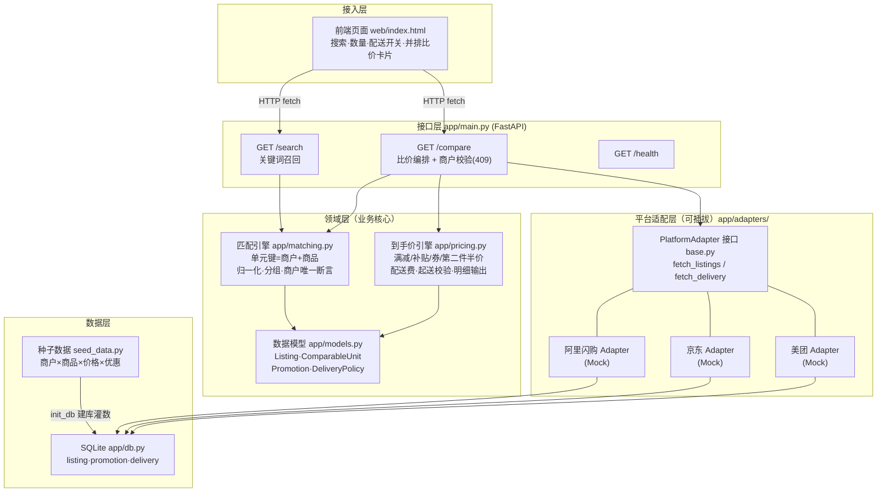

# 饮品比价系统 · 设计文档

- **版本**：v0.2（商户约束重构）
- **范围**：对 **阿里闪购 / 京东 / 美团** 三个平台上的**饮料饮品**进行比价
- **目标**：用户搜索一款饮品，系统展示三个平台的**到手价**并排对比，标出最便宜方
- **关联文档**：[测试报告.md](测试报告.md)

---

## 1. 目标与范围

### 1.1 要做的

- 比价平台：**阿里闪购、京东、美团**（三方）
- 品类：**饮料 / 饮品**
  - 瓶装/罐装标品（可乐、矿泉水、瓶装茶饮/果汁…）
  - 现制饮品（奶茶、咖啡、鲜榨…）
- 核心能力：饮品搜索 → 跨平台同款匹配 → 到手价计算 → 三方并排比价 → 标注最优

### 1.2 本期不做

- 不做代下单/代付（仅展示与跳转）
- 不做饮品以外品类
- 不做真实平台实时抓取（先用 Mock 数据，适配器可插拔，见 §5）

---

## 2. 核心规则：同商户比价约束 ⭐

**比价的每一个产品必须来自相同的商户（门店）。** 这是 v0.2 引入的硬性业务规则：

> 只有**同一家商户**在不同平台上架的同款商品，才会被对齐为一个「可比单元」参与比价。同款商品（哪怕条码完全相同）由不同商户售卖时，形成**多个互相独立**的可比单元，互不比价。

**为什么**：不同商户的进货成本、配送起点、服务质量不同，跨商户混比会造成「看起来便宜但根本不是同一家店」的误导；同商户跨平台比价才回答用户真正的问题——*同一家店的同一件商品，走哪个平台下单更便宜*。

**三层保障**：

| 层 | 机制 | 位置 |
| --- | --- | --- |
| 匹配层 | 可比单元键 = **商户 + 商品**（条码或品牌+品名+规格）| `app/matching.py: unit_key` |
| 构建层 | 单元构建时断言组内商户唯一，防未来回归 | `app/matching.py: build_units` |
| 接口层 | `/compare` 双保险校验，跨商户单元返回 409 拒绝比价 | `app/main.py` |

**商户身份对齐说明**：当前按「归一化商户名」对齐跨平台的同一门店；真实数据阶段需引入商户主数据映射（同一门店在各平台的挂名可能不同，如「永辉超市(朝阳店)」vs「永辉超市朝阳北路店」）。

---

## 3. 为什么饮品比餐饮外卖更好比

饮品品类**标准化程度高**，商户内的商品对齐天然更可靠：

| 类型 | 匹配主键（商户内）| 匹配强度 |
| --- | --- | --- |
| 瓶装/罐装标品 | 条码 | 强（精确匹配）|
| 现制饮品 | 品牌 + 品名 + 规格（杯型/糖冰）| 中（归一化匹配）|

现制饮品的规格写法差异（`大杯/正常糖/去冰` vs `大杯 正常糖 去冰` vs 全角空格）由归一化器统一吸收。

---

## 4. 系统架构

### 4.1 组件架构图



### 4.2 组件职责与相互关系

| 组件 | 职责 | 依赖谁 | 被谁依赖 |
| --- | --- | --- | --- |
| **前端页面**（`web/index.html`）| 搜索框、数量/配送开关、单元卡片（含商户标签）、三平台并排比价卡与明细、最优高亮 | 接口层（HTTP）| 用户 |
| **接口层**（`app/main.py`）| 启动时编排「建库→适配器取数→构建可比单元」；`/search` 召回；`/compare` 比价编排（数量、配送口径、起送校验、最优评选、跨商户 409）| 匹配引擎、到手价引擎、适配器 | 前端 |
| **匹配引擎**（`app/matching.py`）| 归一化（大小写/空格/分隔符）；单元键=**商户+条码/品名规格**；分组构建可比单元并断言商户唯一；关键词搜索（含商户名）| 数据模型 | 接口层 |
| **到手价引擎**（`app/pricing.py`）| 按序应用第二件半价→满减→补贴→券；配送费与免配门槛；起送价校验；输出逐行明细 | 数据模型 | 接口层 |
| **数据模型**（`app/models.py`）| `Listing`（含 merchant）、`ComparableUnit`（含 merchant 约束）、`Promotion`、`DeliveryPolicy` | — | 匹配/算价/适配器 |
| **适配器接口**（`app/adapters/base.py`）| 统一取数契约 `fetch_listings()` / `fetch_delivery()`；Mock 基类读 SQLite | 数据层 | 三平台适配器、接口层 |
| **三平台适配器**（`alibaba/jd/meituan.py`）| 各平台一个实现，当前为 Mock；未来替换为官方 API/合规采集，上层不动 | 适配器接口 | 接口层 |
| **数据层**（`app/db.py` + `seed_data.py`）| 建表灌数（listing 含 merchant 列）、按平台读取条目与配送策略 | 种子数据 | 适配器 |
| **测试**（`tests/`）| 24 项：匹配/商户约束 10 项 + 算价 14 项 | 全部组件 | CI/开发者 |

### 4.3 关键数据流

**启动流**：
```
seed_data → db.init_db 建库灌数
→ 三平台 Adapter.fetch_listings()（各自平台条目）
→ matching.build_units()（按 商户+商品 分组 → 可比单元，断言商户唯一）
→ 常驻内存供查询
```

**比价查询流**：
```
用户(关键词, 数量, 是否含配送)
→ /search 召回可比单元（卡片带商户标签）
→ 用户点击某单元 → /compare
   → 商户唯一性双保险校验（违反 → 409）
   → 对单元内每个平台条目：pricing.compute_price(数量, 配送口径, 起送价)
   → 过滤不可下单者后评选最优、计算节省
→ 前端并排渲染（最优高亮、明细逐行、不可下单灰显）
```

---

## 5. 数据来源策略（关键决策）

三大平台无公开免费比价接口，真实数据需授权/合规采集。为保证**沙盒内即可跑、可测**：

- **MVP 采用「适配器 + Mock 数据」**：内置商户×商品×优惠的种子数据，全链路真实可运行（见[测试报告](测试报告.md)）。
- **适配器可插拔**：`PlatformAdapter` 接口稳定，未来接真实数据源只替换实现类，业务层零改动。
- **合规前置**：真实数据阶段优先官方/合作 API；采集方案须先过合规评审。

---

## 6. 数据模型

```
Listing         平台商品条目   platform, merchant⭐, brand, name, spec,
                              type(bottled/made), barcode?, list_price, sale_price, promotions[]
ComparableUnit  可比单元       id, merchant⭐(单元内唯一), name, brand, spec, type, listings[]
Promotion       优惠          kind(满减/补贴/券/第二件半价), desc, value, threshold
DeliveryPolicy  配送策略       platform, base_fee, free_over
MIN_ORDER       起送价        平台 → 起送金额（现制饮品适用）
```

- ⭐ `merchant` 是 v0.2 新增的比价边界字段，贯穿条目→单元→比价结果全链路。
- 金额统一以「分」存储，展示换算为「元」。

---

## 7. 到手价计算口径

```
单平台到手价 =
    售价(sale_price) × 数量
  − 第二件半价（每两件折一件半价）
  − 满减（小计达门槛）
  − 平台补贴（封顶不超应付）
  − 优惠券（达门槛，按序叠加）
  + 配送费（小计满免配线则为 0）
  （现制饮品：小计未达起送价 → 标记不可下单、不参与最优评选）
```

- 优惠按固定顺序应用：第二件半价 → 满减 → 补贴 → 券（规则表驱动，见 `pricing._KIND_ORDER`）。
- 输出**结构化明细**（售价→各项优惠→配送→到手价），前端逐行透明展示。

---

## 8. 接口设计

| 接口 | 方法 | 入参 | 出参 |
| --- | --- | --- | --- |
| `/search` | GET | `q`（关键词，可搜商户名）| 可比单元列表（含 merchant）|
| `/compare` | GET | `unit_id`, `qty?`, `include_delivery?` | 各平台到手价+明细+merchant、最优、节省；跨商户 → 409 |
| `/health` | GET | - | 服务状态、单元/条目数 |
| `/` | GET | - | 前端页面 |

`/compare` 返回示例（结构示意）：

```json
{
  "beverage": {"name": "可口可乐 经典可乐 330ml×6罐", "merchant": "永辉超市(朝阳店)"},
  "quantity": 1,
  "include_delivery": true,
  "platforms": [
    {"platform": "阿里闪购", "merchant": "永辉超市(朝阳店)", "final_price": 1690,
     "orderable": true, "breakdown": [{"label": "售价小计", "amount": 1390}, ...]},
    {"platform": "京东", "merchant": "永辉超市(朝阳店)", "final_price": 1690, ...},
    {"platform": "美团", "merchant": "永辉超市(朝阳店)", "final_price": 1950, ...}
  ],
  "cheapest": "阿里闪购",
  "savings_vs_max": 260
}
```

---

## 9. 技术选型

| 层 | 选型 | 理由 |
| --- | --- | --- |
| 后端 | Python + FastAPI | 轻量、自带 OpenAPI 文档、沙盒秒起 |
| 存储 | SQLite（种子数据）| 零配置，克隆即跑 |
| 前端 | 原生 HTML + JS（单页）| 比价并排展示，Chromium 可直接演示 |
| 适配器 | 统一接口 + Mock 实现 | 可插拔，未来接真实数据 |
| 测试 | pytest + Playwright(Chromium) | 单元/接口 + 端到端 UI 截图验证 |

---

## 10. 目录结构

```
beverage-price-comparison/
├── docs/
│   ├── 设计文档.md          本文档
│   ├── 测试报告.md          7 场景端到端 + 24 项 pytest 汇总
│   └── img/                 各场景 UI 截图
├── app/
│   ├── main.py              FastAPI 入口 + 比价编排 + 商户校验
│   ├── models.py            数据模型（Listing 含 merchant）
│   ├── db.py                SQLite + 种子数据
│   ├── matching.py          匹配引擎（商户+商品 单元键）
│   ├── pricing.py           到手价引擎
│   └── adapters/            平台适配器（阿里闪购/京东/美团，Mock 可插拔）
├── web/index.html           前端页面（商户标签 + 并排比价）
├── tests/                   pytest（匹配/商户约束 + 算价 + 接口）
├── seed_data.py             Mock 种子数据（商户×商品×优惠）
└── requirements.txt
```

---

## 11. 沙盒测试说明

- 本系统设计为在云端沙盒容器内**直接运行与演示**：启动 FastAPI 服务 + 前端页面，用内置种子数据完整验证搜索/匹配/算价/比价全流程。
- 端到端验证结论见 [测试报告.md](测试报告.md)：7 个 UI 场景（同一界面流程逐一截图）+ 24 项自动化测试全部通过。
- 沙盒容器为临时环境，适合开发与演示；长期在线部署需另配服务器/云平台。

---

## 12. 版本记录

| 版本 | 内容 |
| --- | --- |
| v0.1 | 三平台饮品比价 MVP：匹配（条码/品名规格）、到手价引擎、并排比价前端 |
| v0.2 | **商户约束重构**：比价严格限定同商户；商户贯穿模型/匹配/接口/前端；测试 14→24 项；新增端到端测试报告与组件架构图 |
